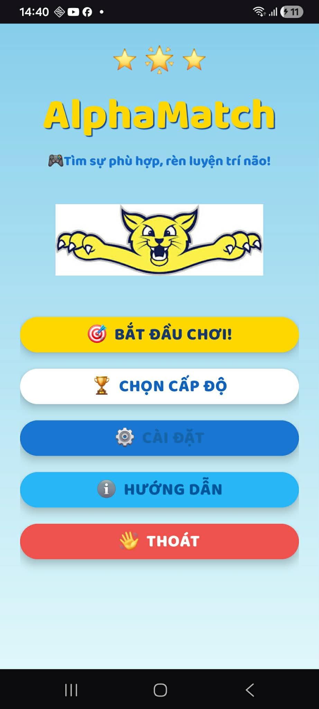
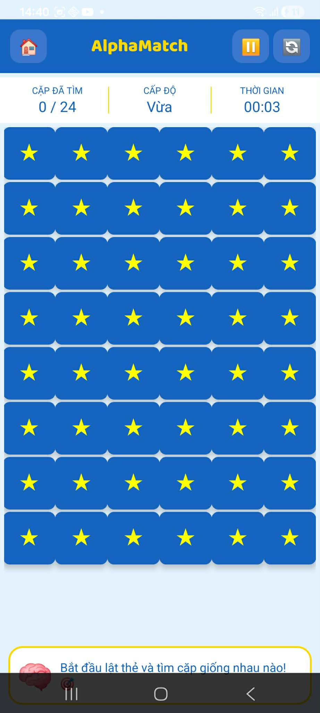
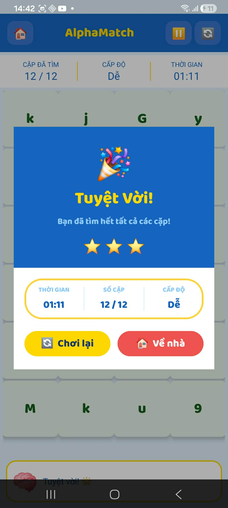

# AlphaMatch

AlphaMatch là một trò chơi giải đố trên nền tảng Android, nơi người chơi cần tìm và ghép các cặp ký tự giống nhau. Trò chơi được phát triển bằng Java trên Android Studio theo mô hình lập trình hướng đối tượng.

## 📱 Tính năng chính

* Nhiều cấp độ chơi với độ khó tăng dần
* Hệ thống tính điểm theo thời gian hoàn thành
* Hiển thị số sao đạt được sau mỗi màn chơi
* Bộ đếm thời gian trực tiếp
* Chức năng chơi lại (Restart)
* Giao diện đơn giản, thân thiện với người dùng
* Hiệu ứng âm thanh khi thao tác

## 🛠 Công nghệ sử dụng

* Java
* Android Studio
* Android SDK
* XML Layout
* MediaPlayer
* SharedPreferences

## 📂 Cấu trúc dự án

```
## 📂 Project Structure

```text
AlphaMatch
│
├── app
│   ├── src
│   │   ├── main
│   │   │   ├── java
│   │   │   │   └── com.example.twochar
│   │   │   ├── res
│   │   │   │   ├── drawable
│   │   │   │   ├── font
│   │   │   │   ├── layout
│   │   │   │   ├── mipmap
│   │   │   │   ├── raw
│   │   │   │   ├── values
│   │   │   │   └── xml
│   │   │   └── AndroidManifest.xml
│   │   │
│   │   ├── androidTest
│   │   └── test
│   │
│   └── build.gradle.kts
│
├── gradle
├── screenshots
├── build.gradle.kts
├── settings.gradle.kts
└── README.md
```


## 🚀 Cài đặt

### Yêu cầu

* Android Studio Hedgehog hoặc mới hơn
* Android SDK 24+
* JDK 17

### Các bước chạy dự án

1. Clone repository:

```bash
git clone https://github.com/your-username/AlphaMatch.git
```

2. Mở Android Studio

3. Chọn:

```
File → Open → AlphaMatch
```

4. Đồng bộ Gradle:

```
Sync Project with Gradle Files
```

5. Chạy ứng dụng:

```
Run → Run App
```

## 🎮 Cách chơi

1. Chọn cấp độ muốn chơi.
2. Quan sát bảng ký tự.
3. Tìm hai ký tự giống nhau có thể ghép nối hợp lệ.
4. Ghép tất cả các cặp trước khi hết thời gian.
5. Hoàn thành màn chơi để nhận điểm và số sao tương ứng.

## 📸 Screenshot

### Màn hình chính



### Màn hình chơi game



### Màn hình kết quả



## 📈 Hướng phát triển

* Thêm bảng xếp hạng (Leaderboard)
* Tích hợp Firebase
* Lưu tiến trình người chơi
* Thêm nhiều chủ đề giao diện
* Hỗ trợ Dark Mode

## 👨‍💻 Tác giả

Tên: Nguyễn Trung Tú

Sinh viên Công nghệ Thông tin

GitHub: https://github.com/your-username

## 📄 Giấy phép

Dự án được phát triển nhằm mục đích học tập và nghiên cứu.
